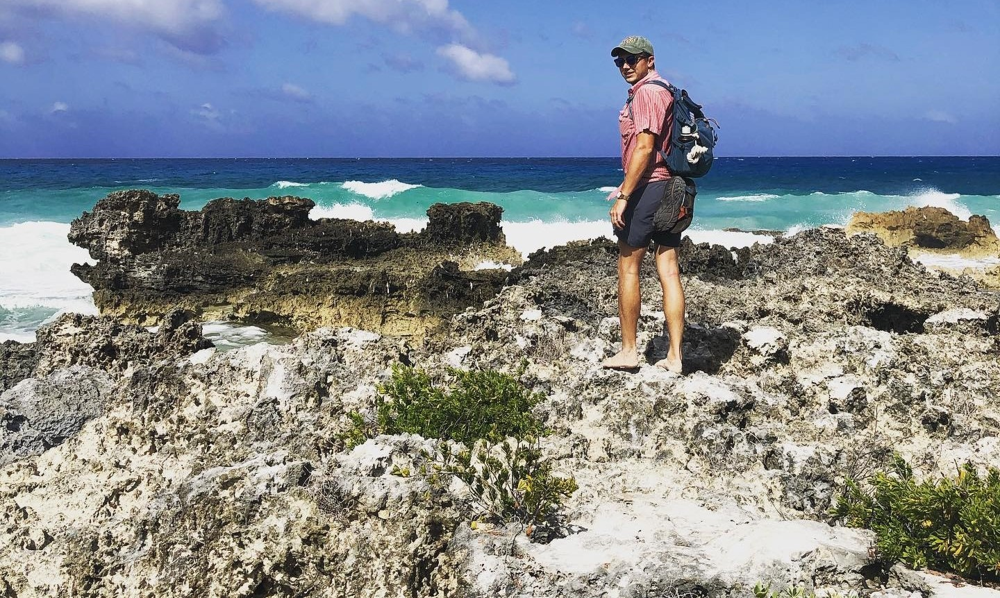

<!-- README.md is generated from README.Rmd. Please edit that file -->

# Alex Baecher's research website

<!-- badges: start -->

## Welcome

Hi everyone, 

My name is Alex Baecher, I'm a phd student in the School of Natural Resources and Environment at the University of Florida. I belong to the [Scheffers lab](https://www.schefferslab.com/), which is housed in the Department of Wildlife Ecology and Conservation. Please see our [lab github](https://github.com/schefferslab) for some collaborative projects, or the webpages/RG/scholar pages of my advisor, [Brett Scheffers](https://scholar.google.com/citations?user=4HfsgFUAAAAJ&hl=en) and lab mates: [Dave Klinges, phd student](https://natureinparadise.github.io/), [Dr. Ed Basham, graduated](https://www.edmundbasham.com/), and [Dr. Luke Evans](https://www.researchgate.net/profile/Luke-Evans-2) for more info on our research group!

My github, `slamanader` (a joke on how many times I've misspelled "Salamander"), is a home to some--mostly unfinished--projects, with varying degrees of functionality and reproducibility. This repo is for my personal research website: [www.alexbaecher.com](www.alexbaecher.com). You may also see my [Research Gate](https://www.researchgate.net/profile/Joseph-Baecher), [Google Scholar](https://www.linkedin.com/in/alex-baecher-5972a43b/), and [LinkedIn](https://www.linkedin.com/in/alex-baecher-5972a43b/); and if you have social media, find me on [facebook](https://www.facebook.com/baechermander), [instagram](https://www.instagram.com/j_baecher/), and [twitter](https://twitter.com/AlexBaecher). 

## Research interests
I am an ecologist, with training in herpetology and landscape ecology, and I have an interest in research at the interface between conservation, ecology theory, and mathematical modeling. My research is aimed at developing cutting-edge quantitative solutions to model complex data about the ecology of reptiles and amphibians. I primarily work with invasive species and species of conservation concern to determine how landscape attributes affect the dynamics and connectivity of populations, while providing management-relevant reccomendations to effectively manage species. 

Hopefully you'll find some of the items on my github and website interesting or useful. Please contact me either directly through github, or through my website. 

Cheers, 

-Alex. 
