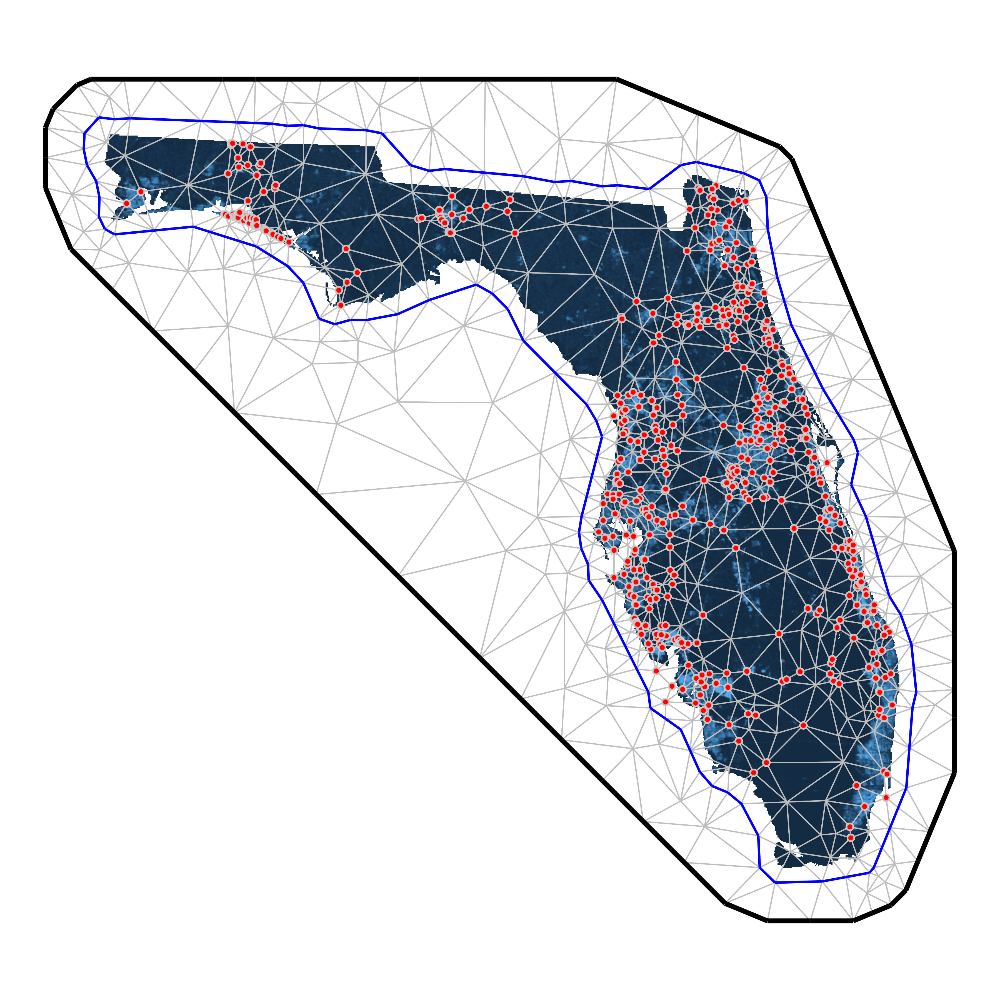
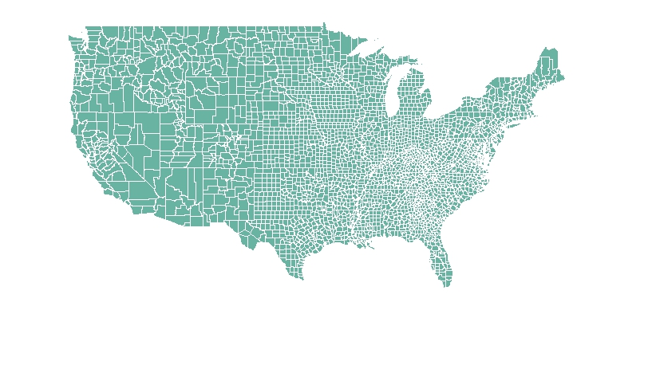

## Why include spatial structures in your model?

**Spatial Autocorrelation:** 
Ecological data points close together are usually more similar than distant points
{ width=100% }

#### Warning:  
**Ignoring spatial autocorrelation leads to...**  

- Biased parameter estimates
- Inflated significance (increased chance of Type-I error)
- Reduced model precision 
- Inaccurate model selection
- Violated statistical assumptions (iid errors)
- Poor predictive accuracy
- *Non-demonic* intrusion 😈  

## The Central Question

## **What type of spatial data do you have?**

Each data type has specialized methods, assumptions, and computational considerations.

**Data types:**

1. **Point-Referenced Data** (geostatistical data)
2. **Areal/Lattice Data** (regional/grid data)  
3. **Point Pattern Data** (locations are the response)
4. **Movement/Trajectory Data** (tracks and telemetry)

## Mixed Data Types
Many ecological studies combine multiple data types! We'll discuss integration approaches at the end.

# 1. Point-Referenced Data

*Measurements at specific geographic coordinates*

---

## What is Point-Referenced Data?

**Definition:** Observations collected at specific locations, representing a continuous spatial process.

**Ecological Examples:**

- Species abundance at survey points
- Vegetation cover at plot locations
- Soil samples across a landscape
- Individual tree measurements in a forest

**Key characteristic:** Locations are **fixed by design**, not random.

---

## Point-Referenced: Visual Example

**Typical scenario:**  

- 50-5000 sampling locations  
- Environmental covariates at each point  
- Response variable (abundance, presence, etc.)  
- Want to predict across unsampled locations  

## Common Questions
- How does my response vary across space?
- What drives spatial patterns?
- Can I predict to new locations?
- Is there residual spatial autocorrelation?

{ width=75% }

---

## Point-Referenced: Core Challenge

After accounting for environmental covariates, you often have residual spatial structure:

$$y(\mathbf{s}) = \mathbf{X}(\mathbf{s})\boldsymbol{\beta} + w(\mathbf{s}) + \epsilon(\mathbf{s})$$

Where:

- $y(\mathbf{s})$ = response at location $\mathbf{s}$
- $\mathbf{X}(\mathbf{s})\boldsymbol{\beta}$ = fixed effects (environmental covariates)
- $w(\mathbf{s})$ = **spatial random effect** (what we need to model!)
- $\epsilon(\mathbf{s})$ = non-spatial noise

---

## Point-Referenced: Five Approaches

We'll cover five main approaches, organized by their relationship to Gaussian Processes:

1. **Full Gaussian Processes (GPs)** - theoretical *gold standard*
2. **SPDE Approximation** - Exact GPs using basis functions
3. **Low-Rank Gaussian Processes** - Approximate GPs for efficiency
4. **Nearest Neighbor GPs** - Local GP approximations
5. **Spatial Splines** - Alternative smoothing framework (non-GP)

Each represents different trade-offs between accuracy, computation, and flexibility.

---

## Understanding the GP Family Tree

## Conceptual Relationships  

**Full GP** ($O(n^3)$)  

- Exact, but computationally prohibitive for large $n$

**Reduced-Rank GP Approximations:**  

- **SPDE** - Exact Matérn GP via finite elements (sparse matrices)  
- **Low-Rank GP** - Approximate using subset of basis functions  
- **Nearest Neighbor GP** - Local conditioning on nearby points  

**Alternative Framework:**  

- **Splines** - Smoothness penalty instead of covariance structure  

**Key insight:** Methods 2-4 are all ways to make GPs computationally feasible while maintaining the probabilistic framework.

---

## Method 1: Full Gaussian Processes

**The gold standard for point-referenced data**

$$w(\mathbf{s}) \sim \mathcal{GP}(0, k(\mathbf{s}, \mathbf{s}'))$$

**Covariance function** defines spatial correlation:

$$k(\mathbf{s}, \mathbf{s}') = \sigma^2 \exp\left(-\frac{||\mathbf{s} - \mathbf{s}'||^2}{2\ell^2}\right)$$

**Parameters:**  

- $\sigma^2$ = spatial variance (how much spatial variation?)  
- $\ell$ = length-scale (how far does correlation extend?)  

---

## Full GP: Covariance Functions

**Matérn family** (most common in ecology):

$$k(d) = \sigma^2 \frac{2^{1-\nu}}{\Gamma(\nu)}\left(\sqrt{2\nu}\frac{d}{\ell}\right)^\nu K_\nu\left(\sqrt{2\nu}\frac{d}{\ell}\right)$$

**Special cases:**

- $\nu = 0.5$ → **Exponential** (rough surfaces)
- $\nu = 1.5$ → Once differentiable (good default)
- $\nu = 2.5$ → Twice differentiable  
- $\nu \to \infty$ → **Squared exponential** (infinitely smooth)

## Practical Advice
Start with $\nu = 1.5$ (good default) or estimate it if you have enough data.

---

## Full GP: The Computational Problem

**Standard GP inference requires:**

- Inverting an $n \times n$ covariance matrix: $O(n^3)$ operations
- Storing the matrix: $O(n^2)$ memory

**Practical limits:**

- ~1,000 locations: comfortable
- ~5,000 locations: challenging
- 10,000+ locations: infeasible

## This is why we need approximations!
Reduced rank GPs make modeling feasible for realistic ecological datasets.

---

## Full GP: R Implementation

```r
library(geoR)
library(fields)

# Using geoR for ML estimation
geo_data <- as.geodata(data, coords.col = 1:2, data.col = 3)

# Fit variogram
vario <- variog(geo_data, max.dist = 100)
plot(vario)

# Fit Matérn model
fit_ml <- likfit(
  geo_data,
  ini.cov.pars = c(1, 10),  # Initial sigma^2, range
  cov.model = "matern",
  kappa = 1.5,              # nu parameter
  fix.kappa = TRUE
)

summary(fit_ml)

# Kriging predictions
pred_grid <- expand.grid(
  x = seq(min(data$x), max(data$x), length = 50),
  y = seq(min(data$y), max(data$y), length = 50)
)

kc <- krige.control(
  type.krige = "OK",
  obj.model = fit_ml
)

predictions <- krige.conv(
  geo_data,
  locations = pred_grid,
  krige = kc
)

# Plot predictions
image.plot(predictions$predict)
```

---

## Method 2: SPDE Approximation

**The SPDE approach** (Lindgren et al. 2011) makes GPs computationally tractable!

**Key insight:** A Matérn GP is the solution to a *stochastic partial differential equation*:

$$(\kappa^2 - \Delta)^{\alpha/2}(\tau w(\mathbf{s})) = \mathcal{W}(\mathbf{s})$$

**Critical distinction:** SPDE provides an **exact** representation of the Matérn GP, not an approximation.

**Practical result:**  

- Represent continuous GP using finite element basis functions  
- Sparse precision matrices enable fast computation  
- Reduces $O(n^3)$ to approximately $O(n^{3/2})$ or better  
- Makes analysis of 10,000+ locations feasible  

---

## SPDE: How It Works

1. Create triangular mesh over study area
2. GP represented exactly at mesh vertices
3. Values between vertices interpolated

**Mesh construction is critical:**  

- Finer mesh = better approximation  
- Coarser mesh = faster computation  
- Balance accuracy and speed  
- Extend mesh beyond study area 

## Rule of Thumb
Mesh resolution should be finer than the spatial range ($\ell$), ideally <1k 

{ width=100% }

---

## SPDE: R Implementation with `sdmTMB`

```r
library(sdmTMB)

# Create mesh object that contains matrices to apply the SPDE approach
mesh <- make_mesh(pcod, xy_cols = c("X", "Y"), cutoff = 10)

# Fit a spatial model with a smoother for depth:
fit <- sdmTMB(
  density ~ s(depth),
  data = pcod,
  mesh = mesh,
  family = tweedie(link = "log"),
  spatial = "on"
)

# Run some basic sanity checks on our model:
sanity(fit)

# Use the ggeffects package to plot the smoother effect:
ggeffects::ggpredict(fit, "depth [50:400, by=2]") %>%
   plot()

# Obtain spatial predictions: 
p <- predict(fit, newdata = qcs_grid)

# Map predictions 
ggplot(p, aes(X, Y, fill = exp(est))) + geom_raster() +
  scale_fill_viridis_c(trans = "sqrt")

```

---

## SPDE: R Implementation with `INLA`

```r
library(INLA)
library(inlabru)

# Create mesh over study region
mesh <- inla.mesh.2d(
  loc = cbind(data$x, data$y),  # Data locations
  max.edge = c(5, 20),           # Inner and outer max edge
  cutoff = 1,                    # Min distance between mesh nodes
  offset = c(10, 30)             # Inner and outer extension
)

# Visualize mesh
plot(mesh)
points(data$x, data$y, col = "red", pch = 16)

# Define SPDE model (Matérn with alpha=2 gives nu=1)
spde <- inla.spde2.matern(
  mesh = mesh, 
  alpha = 2  # alpha = nu + d/2, where d=2 (spatial dimensions)
)

# Create projection matrix (links data locations to mesh)
A <- inla.spde.make.A(
  mesh = mesh,
  loc = cbind(data$x, data$y)
)

# Stack data for INLA
stack <- inla.stack(
  data = list(y = data$abundance),
  A = list(A, 1),
  effects = list(
    spatial = 1:spde$n.spde,
    data.frame(
      Intercept = 1,
      elevation = data$elevation,
      forest_cover = data$forest_cover
    )
  )
)

# Fit model
formula <- y ~ -1 + Intercept + elevation + forest_cover +
  f(spatial, model = spde)

result <- inla(
  formula,
  family = "poisson",
  data = inla.stack.data(stack),
  control.predictor = list(
    A = inla.stack.A(stack),
    compute = TRUE
  ),
  control.compute = list(
    dic = TRUE,
    waic = TRUE,
    cpo = TRUE
  )
)

summary(result)

# Extract spatial field estimates
spde_result <- inla.spde2.result(result, "spatial", spde)
```

---

## SPDE: Making Predictions

```r
# Create prediction grid
pred_coords <- expand.grid(
  x = seq(min(data$x), max(data$x), length = 100),
  y = seq(min(data$y), max(data$y), length = 100)
)

# Projection matrix for predictions
A_pred <- inla.spde.make.A(
  mesh = mesh,
  loc = as.matrix(pred_coords)
)

# Create prediction stack
stack_pred <- inla.stack(
  data = list(y = NA),  # NA for prediction
  A = list(A_pred, 1),
  effects = list(
    spatial = 1:spde$n.spde,
    data.frame(
      Intercept = 1,
      elevation = mean(data$elevation),
      forest_cover = mean(data$forest_cover)
    )
  )
)

# Combine with original data
stack_full <- inla.stack(stack, stack_pred)

# Refit model with prediction stack
result_pred <- inla(
  formula,
  family = "poisson",
  data = inla.stack.data(stack_full),
  control.predictor = list(
    A = inla.stack.A(stack_full),
    compute = TRUE,
    link = 1
  )
)

# Extract predictions
idx_pred <- inla.stack.index(stack_full, "stack_pred")$data
pred_coords$mean <- result_pred$summary.fitted.values$mean[idx_pred]
pred_coords$sd <- result_pred$summary.fitted.values$sd[idx_pred]

# Map predictions
library(ggplot2)
ggplot(pred_coords, aes(x, y, fill = mean)) +
  geom_raster() +
  scale_fill_viridis_c() +
  coord_equal() +
  theme_minimal()
```

---

## Method 3: Low-Rank Gaussian Processes

**Reduced-rank GP approximations** for computational efficiency

**Key idea:** Approximate the spatial field using a smaller set of basis functions:

$$w(\mathbf{s}) \approx \sum_{j=1}^{m} \beta_j \phi_j(\mathbf{s})$$

Where $m << n$ (number of basis functions much less than data points).

**Common approaches:**

- **Predictive Processes** - GPs at knot locations
- **Subset of Regressors** - GP conditioning on subset
- **Fixed Rank Kriging** - Low-rank spatial covariance

---

## Low-Rank GP: Predictive Processes

**Concept:** 

1. Choose $m$ knot locations (e.g., 50-200 knots)
2. Define full GP at knots
3. Predict data locations as function of knot GPs

$$w(\mathbf{s}) \approx \mathbf{C}(\mathbf{s}, \mathbf{s}^*) \mathbf{C}(\mathbf{s}^*, \mathbf{s}^*)^{-1} w(\mathbf{s}^*)$$

Where $\mathbf{s}^*$ are knot locations.

**Computational cost:** $O(nm^2 + m^3)$ - dominated by $m^3$ for reasonable $n$

## Choosing m
More knots = better approximation but slower. Start with $m = \sqrt{n}$ or 50-100 knots.

---

## Low-Rank GP: R Implementation

```r
library(spBayes)
library(MBA)  # For knot placement

# Define knots (can be data locations or regular grid)
n_knots <- 100

# Create regular grid of knots
knot_coords <- expand.grid(
  x = seq(min(data$x), max(data$x), length = sqrt(n_knots)),
  y = seq(min(data$y), max(data$y), length = sqrt(n_knots))
)

# Alternatively, use k-means clustering for adaptive knots
# kmeans_result <- kmeans(cbind(data$x, data$y), centers = n_knots)
# knot_coords <- kmeans_result$centers

# Prepare data for spBayes
coords <- cbind(data$x, data$y)
X <- model.matrix(~ elevation + forest_cover, data = data)
y <- data$abundance

# Set up predictive process model
n_samples <- 5000
starting <- list(
  "phi" = 3/max(dist(coords)),  # 3/max_distance rule of thumb
  "sigma.sq" = 1,
  "tau.sq" = 0.1
)

tuning <- list(
  "phi" = 0.1,
  "sigma.sq" = 0.1,
  "tau.sq" = 0.1
)

priors <- list(
  "beta.Flat",
  "phi.Unif" = c(3/max(dist(coords)), 3/min(dist(coords))),
  "sigma.sq.IG" = c(2, 1),
  "tau.sq.IG" = c(2, 0.1)
)

# Fit predictive process model
pp_model <- spLM(
  y ~ X - 1,
  coords = coords,
  knots = as.matrix(knot_coords),
  starting = starting,
  tuning = tuning,
  priors = priors,
  cov.model = "exponential",
  n.samples = n_samples,
  verbose = TRUE,
  n.report = 500
)

# Burn-in and thin
burn_in <- 0.5 * n_samples
pp_samples <- spRecover(
  pp_model,
  start = burn_in,
  thin = 2
)

summary(pp_samples)
```

---

## Low-Rank GP: Alternative with `FRK`

```r
library(FRK)  # Fixed Rank Kriging

# Create basis functions (2 resolutions)
basis <- auto_basis(
  data = data.frame(x = data$x, y = data$y),
  nres = 2,           # Number of resolutions
  type = "bisquare"   # Basis function type
)

# Prepare data
sp_data <- SpatialPointsDataFrame(
  coords = cbind(data$x, data$y),
  data = data.frame(
    z = data$abundance,
    elevation = data$elevation,
    forest_cover = data$forest_cover
  )
)

# Fit FRK model
frk_model <- FRK(
  f = z ~ elevation + forest_cover,
  data = list(sp_data),
  basis = basis,
  response = "poisson"  # Or "gaussian" for continuous
)

# Predictions
pred_grid <- SpatialPoints(
  coords = cbind(pred_coords$x, pred_coords$y)
)

predictions <- predict(frk_model, newdata = pred_grid)
```

---

## Method 4: Nearest Neighbor Gaussian Processes

**For very large datasets** (>10,000 points)

**Key idea:** Each location conditions only on its $m$ nearest neighbors (typically $m = 10-30$)

$$w(\mathbf{s}_i) | \{w(\mathbf{s}_j): j \in \mathcal{N}_m(i)\} \sim \text{Normal}(\boldsymbol{\mu}_i, \sigma^2_i)$$

**Advantages:**  

- Scales to massive datasets (100,000+ locations)  
- Maintains proper GP framework  
- Computationally efficient: $O(nm^3)$  
- Can be highly accurate  

**Key development:** Datta et al. (2016) - Nearest Neighbor Gaussian Process

---

## Nearest Neighbor GP: How It Works

**Response model:** Define ordered observations $\mathbf{y} = (y_1, \ldots, y_n)$

**Neighbor set:** For each $i$, define $\mathcal{N}_m(i)$ = indices of $m$ nearest neighbors (prior to $i$)

**Conditional specification:**

$$p(w_i | w_1, \ldots, w_{i-1}) = p(w_i | w_{\mathcal{N}_m(i)})$$

**Result:** Sparse precision matrix, fast computation

## The ordering of your data affects results!

Common factors to order by: 

- by coordinate  
- space-filling curves  
- random  

---

## Nearest Neighbor GP: R package `spNNGP`

```r
library(spNNGP)

# Prepare data
coords <- cbind(data$x, data$y)
X <- model.matrix(~ elevation + forest_cover, data = data)
y <- data$abundance

# Set up NNGP model
n_neighbors <- 15  # Typical range: 10-30

# Starting values
starting <- list(
  "phi" = 3/max(dist(coords)),
  "sigma.sq" = 1,
  "tau.sq" = 0.1,
  "beta" = rep(0, ncol(X))
)

# Tuning parameters
tuning <- list(
  "phi" = 0.5,
  "sigma.sq" = 0.1,
  "tau.sq" = 0.1,
  "beta" = 0.1
)

# Prior distributions
priors <- list(
  "beta.Flat",
  "phi.Unif" = c(3/max(dist(coords)), 3/0.01),
  "sigma.sq.IG" = c(2, 1),
  "tau.sq.IG" = c(2, 0.1)
)

# Fit NNGP model
nngp_model <- spNNGP(
  formula = y ~ X - 1,
  coords = coords,
  starting = starting,
  method = "response",
  n.neighbors = n_neighbors,
  tuning = tuning,
  priors = priors,
  cov.model = "exponential",
  n.samples = 5000,
  n.omp.threads = 4,  # Parallel threads
  verbose = TRUE
)

# Posterior summaries
summary(nngp_model$p.beta.samples)
summary(nngp_model$p.theta.samples)

# Predictions at new locations
pred_coords_mat <- as.matrix(pred_coords[, c("x", "y")])
X_pred <- cbind(
  1,
  mean(data$elevation),
  mean(data$forest_cover)
)

predictions <- predict(
  nngp_model,
  X.0 = X_pred,
  coords.0 = pred_coords_mat,
  n.omp.threads = 4
)

# Extract mean predictions
pred_mean <- apply(predictions$p.y.0, 1, mean)
pred_sd <- apply(predictions$p.y.0, 1, sd)
```

## Nearest Neighbor GP: R package `spAbundance`

```r
library(spAbundance)

# Fit Bayesian heirarchical distance sampling model
out <- spDS(
  # State process formula
  abund.formula = ~ forest + grass ,

  # Observation process formula
  det.formula = ~ day + I(day^2) + wind,

  # Model controls
  data = dat.MODO, n.batch = 800, batch.length = 25,
  accept.rate = 0.43, cov.model = "exponential",
  transect = 'point', det.func = 'halfnormal',
  NNGP = TRUE, n.neighbors = 15, n.burn = 10000,
  n.thin = 5, n.chains = 3, verbose = FALSE)

# Posterior predictive check
ppcAbund(out, fit.stat = 'freeman-tukey', group = 1) %>%
  summary()

# Model selection
waicAbund(out)

# Predictions

out.pred <- predict(out, predictors, coordinates, verbose = FALSE)
---

## Method 5: Spatial Splines

**Alternative framework:** Not based on Gaussian Processes

**Key idea:** Approximate spatial surface with smooth basis functions

$$w(\mathbf{s}) = \sum_{k=1}^{K} \beta_k \phi_k(\mathbf{s})$$

**Distinguishing features:**

- Minimize roughness penalty (not maximize likelihood of covariance)
- Deterministic smoothing approach
- Can have Bayesian interpretation (splines as random effects)
- Very fast computation
- Different uncertainty quantification

---

## Spatial Splines: Types

**Thin plate splines** - Optimal smoothness properties

Minimize:
$$\sum_{i=1}^n (y_i - f(\mathbf{s}_i))^2 + \lambda \int \int \left[\left(\frac{\partial^2 f}{\partial x^2}\right)^2 + 2\left(\frac{\partial^2 f}{\partial x \partial y}\right)^2 + \left(\frac{\partial^2 f}{\partial y^2}\right)^2\right] dx\,dy$$

**Tensor product splines** - Product of 1D basis functions

**Radial basis functions** - Distance-based kernels

## When to Use Splines
Splines are excellent for quick exploratory analysis and when you dont need explicit covariance modeling.

---

## Spatial Splines: R Implementation with mgcv

```r
library(mgcv)

# Basic spatial smooth
model_basic <- gam(
  abundance ~ s(x, y, bs = "tp", k = 50),
  family = poisson,
  data = data,
  method = "REML"
)

# With covariates
model_full <- gam(
  abundance ~ 
    s(elevation, k = 10) +
    s(forest_cover, k = 10) +
    s(x, y, bs = "tp", k = 100),
  family = poisson,
  data = data,
  method = "REML"
)

# Check model
summary(model_full)
gam.check(model_full)  # Check basis dimensions and residuals

# Plot effects
plot(model_full, pages = 1, scheme = 2)

# Spatial smooth only
plot(model_full, select = 3, scheme = 2, asp = 1)

# Predictions
pred_data <- expand.grid(
  x = seq(min(data$x), max(data$x), length = 100),
  y = seq(min(data$y), max(data$y), length = 100),
  elevation = mean(data$elevation),
  forest_cover = mean(data$forest_cover)
)

pred_data$fit <- predict(model_full, pred_data, type = "response")
pred_data$se <- predict(model_full, pred_data, type = "response", se.fit = TRUE)$se.fit

# Map predictions
library(ggplot2)
ggplot(pred_data, aes(x, y, fill = fit)) +
  geom_raster() +
  scale_fill_viridis_c() +
  coord_equal() +
  labs(fill = "Predicted\nAbundance") +
  theme_minimal()
```

---

## Spatial Splines: Tensor Products

```r
# Tensor product of marginal smooths (useful for anisotropy)
model_tensor <- gam(
  abundance ~ 
    s(elevation) +
    te(x, y, k = c(10, 10)),  # Tensor product
  family = poisson,
  data = data,
  method = "REML"
)

# Adaptive smooth (varying complexity)
model_adaptive <- gam(
  abundance ~ 
    s(elevation) +
    s(x, y, bs = "ad", k = 100),  # Adaptive smooth
  family = poisson,
  data = data,
  method = "REML"
)

# Soap film smooth (with boundary)
# Useful when study area has complex shape
library(sf)
boundary <- st_read("study_boundary.shp")

# Convert boundary to appropriate format
# (See mgcv::smooth.construct.so.smooth.spec for details)
```

---

## Point-Referenced: Comprehensive Comparison

| Method | Framework | Complexity | Speed | n Limit | Uncertainty | Best Use Case |
|--------|-----------|-----------|-------|---------|-------------|---------------|
| **Full GP** | GP | $O(n^3)$ | Slow | ~1000 | Exact | Small datasets, methodological work |
| **SPDE** | GP (exact) | $O(n^{3/2})$ | Fast | ~50,000 | Exact | Medium-large datasets, Bayesian inference |
| **Low-Rank GP** | GP (approx) | $O(nm^2 + m^3)$ | Medium | ~10,000 | Bayesian | Moderate datasets, flexible |
| **NN-GP** | GP (approx) | $O(nm^3)$ | Fast | 100,000+ | Bayesian | Very large datasets |
| **Splines** | Non-GP | $O(n)$ | Very Fast | 50,000+ | Frequentist | Quick analysis, exploration |

---

## Key R packages

**Full GP:**  `gstat` (classical geostats) + `fields` (spatial random fields)  

**SPDE:**  

- `INLA` + `inlabru` (highly customizable)  
- `sdmTMB` (user friendly, single species) or `tinyVAST` (multi-species)  

**Low-Rank GP:**  `spBayes` or `nimble` (highly customizable Bayesian modeling)  

**Nearest Neighbor GP:**  

- `spNNGP` - Nearest Neighbor Gaussian Processes  
- `spAbundance` & `spOccupancy` (Hierarchical Bayesian models)  

**Splines:**  `mgcv` (GAMs)  or `mvgams` (Hierarchical Bayesian GAMs)

---

## Common Pitfalls and Solutions

## Watch Out For:

**Over-smoothing:**  

- Splines: Check `gam.check()` and increase `k` if needed  
- GPs: Ensure spatial range parameter is estimable  

**Under-smoothing:**  

- Creates overly complex surfaces that don't generalize  
- Use cross-validation to check predictive performance  

**Computational Issues:**  

- Start with small datasets to test workflow  
- Use reduced-rank methods before attempting full GP  
- Consider parallelization for MCMC-based methods  

**Mesh/Knot Placement:**  

- SPDE: Mesh should extend beyond data  
- Low-Rank: Try different knot configurations  

---

## Validation and Model Checking

**Essential diagnostics for all methods:**

```r
# 1. Residual spatial autocorrelation
library(spdep)
coords <- cbind(data$x, data$y)
neighbors <- dnearneigh(coords, 0, max_distance)
weights <- nb2listw(neighbors)
moran.test(residuals(model), weights)

# 2. Variogram of residuals
library(gstat)
resid_variogram <- variogram(
  residuals ~ 1, 
  locations = ~x+y, 
  data = data
)
plot(resid_variogram)  # Should be flat if spatial structure captured

# 3. Spatial cross-validation
library(blockCV)
spatial_blocks <- cv_spatial(
  x = data_sf,
  column = "response",
  k = 5,
  size = 10000
)

# 4. Predictive performance
# Compare RMSE, MAE, coverage of prediction intervals
```

---

## Integration with Covariates

**All methods can include environmental covariates:**

**Additive structure:**
$$y(\mathbf{s}) = \beta_0 + \sum_{j=1}^p f_j(x_j(\mathbf{s})) + w(\mathbf{s}) + \epsilon(\mathbf{s})$$

Where $f_j$ can be:
- Linear effects: $\beta_j x_j$
- Smooth effects: Spline or polynomial
- Interactions: $x_j \times x_k$ or tensor products

## Interpretation Challenge
Spatial random effects can "absorb" covariate effects if covariates are spatially structured. Consider restricted spatial regression or spatial confounding adjustments.

---

## Advanced Topics

**Extensions of point-referenced methods:**

- **Non-stationary GPs** - Spatial parameters vary across space
- **Anisotropic models** - Correlation depends on direction
- **Space-time models** - Add temporal dimension
- **Multivariate spatial models** - Multiple responses
- **Preferential sampling** - Locations not random
- **Measurement error** - Covariate uncertainty

**These typically require specialized implementations of the core methods.**

---

## Summary: Point-Referenced Data

## Key Takeaways

1. **Gaussian Processes** provide the theoretical foundation
2. **SPDE** offers exact GP representation with computational efficiency
3. **Low-Rank and NN-GP** are approximations that scale to large datasets
4. **Splines** provide a fast alternative framework
5. **Choice depends on:** dataset size, computational resources, and inference goals
6. **Start simple** (splines) and add complexity as needed
7. **Always validate** using spatial cross-validation
8. **Check residuals** for remaining spatial structure

---

## Resources and Further Reading

**Key Papers:**

- Lindgren et al. (2011) "An explicit link between Gaussian fields and GMRFs" *JRSS-B*
- Datta et al. (2016) "Hierarchical Nearest-Neighbor Gaussian Process Models" *JASA*
- Banerjee et al. (2008) "Gaussian predictive process models" *JRSS-B*
- Wood (2017) *Generalized Additive Models: An Introduction with R*

**Online Resources:**

- [R-INLA website](https://www.r-inla.org/) - Tutorials and examples
- [mgcv documentation](https://cran.r-project.org/web/packages/mgcv/)
- [Spatial Data Science with R](https://rspatial.org/)

**Books:**

- Banerjee et al. (2014) *Hierarchical Modeling and Analysis for Spatial Data*
- Cressie & Wikle (2011) *Statistics for Spatio-Temporal Data*

---

# Areal / Lattice Data

*Aggregated data in discrete spatial units*

---

## What is Areal Data?

**Definition:** Data aggregated to discrete spatial units with defined boundaries.

**Ecological Examples:**

- Species counts by county or grid cell
- Disease prevalence by administrative unit
- Land cover by hexagonal bins
- Population density by watershed
- Camera trap detections by site

**Key characteristic:** Space is **partitioned** into units; data are **aggregated** within units.

---

## Areal Data: Visual Example

{width 50%}

**Typical scenario:**  

- 20-5000 spatial units (polygons or grid cells)  
- Clear neighborhood structure  
- Count or aggregated data per unit  
- Want to account for spatial dependence  

## Common Questions
- Are neighboring units more similar?
- How do I borrow strength across space?
- Can I smooth noisy estimates?
- Should I worry about edge effects?

---

## Areal Data: Neighborhood Structure

**Critical concept:** Who are my neighbors?

**Common definitions:**

1. **Rook adjacency** - shared border
2. **Queen adjacency** - shared border or corner
3. **Distance-based** - within threshold distance
4. **k-nearest neighbors** - k closest centroids

## Adjacency Matrix
Neighborhood structure encoded in matrix $\mathbf{W}$:
$$w_{ij} = \begin{cases} 1 & \text{if } i \text{ and } j \text{ are neighbors} \\ 0 & \text{otherwise} \end{cases}$$

---

## Areal Data: Method 1 - CAR Models

**Conditional Autoregressive (CAR) Models**

Each area's random effect depends on its neighbors:

$$w_i | \mathbf{w}_{-i}, \tau^2 \sim \text{Normal}\left(\sum_{j \sim i} b_{ij}w_j, \tau_i^2\right)$$

**Most common:** Intrinsic CAR (ICAR)

$$w_i | \mathbf{w}_{-i}, \tau^2 \sim \text{Normal}\left(\frac{1}{n_i}\sum_{j \sim i} w_j, \frac{\tau^2}{n_i}\right)$$

Where $n_i$ = number of neighbors of area $i$.

---

## ICAR Model: Properties

**Interpretation:** Each area's value is the average of its neighbors, plus noise.

**Key properties:**

- Induces **strong** spatial smoothing
- Prior is **improper** (infinite variance)
- Requires sum-to-zero constraint: $\sum_i w_i = 0$
- Variance proportional to $1/n_i$ (islands have high variance!)

## Island Problem
Areas with few neighbors have high uncertainty. Consider removing islands or using proper CAR.

---

## Areal Data: Method 2 - Proper CAR

**Adds spatial decay parameter** $\rho$ to control smoothing strength:

$$w_i | \mathbf{w}_{-i}, \tau^2, \rho \sim \text{Normal}\left(\frac{\rho}{n_i}\sum_{j \sim i} w_j, \frac{\tau^2}{n_i}\right)$$

**Properties:**

- $\rho = 0$ → independent random effects (no spatial structure)
- $\rho \to 1$ → approaches ICAR (maximum smoothing)
- **Proper** prior (finite variance)
- Can estimate $\rho$ from data

**When to use:** When you want data to determine smoothing strength.

---

## Areal Data: Method 3 - BYM Model

**Besag-York-Mollié (BYM) Model** - convolution of spatial and non-spatial effects:

$$w_i = u_i + v_i$$

Where:

- $u_i \sim \text{ICAR}(\tau_u^2)$ → spatially structured
- $v_i \sim \text{Normal}(0, \tau_v^2)$ → unstructured

**Advantage:** Separates spatial and non-spatial variation

## BYM2 Parameterization
Modern version uses a mixing parameter $\phi \in [0,1]$:
$$w_i = \frac{1}{\sqrt{\tau}}(\sqrt{\phi} \cdot u_i + \sqrt{1-\phi} \cdot v_i)$$
Easier to specify priors!

---

## Areal Data: Method 4 - SAR Models

**Simultaneous Autoregressive (SAR) Models**

Different from CAR! Response depends on neighbors' **responses**:

$$\mathbf{y} = \rho \mathbf{W}\mathbf{y} + \mathbf{X}\boldsymbol{\beta} + \boldsymbol{\epsilon}$$

**Key difference:**

- CAR: Spatial dependence in **random effects**
- SAR: Spatial dependence in **response variable** itself
- SAR has "spillover" effects (feedback loops)

**Implementation:** `spdep` package in R

---

## Areal Data: CAR vs SAR

| Feature | CAR | SAR |
|---------|-----|-----|
| What's spatial? | Random effects | Response variable |
| Interpretation | Smoothing | Spillover/feedback |
| Computation | Easy (INLA) | More complex |
| Bayesian | Yes | Possible but harder |
| Ecology use | Very common | Less common |

## In Practice
CAR models are much more common in ecology. SAR models used more in econometrics.

---

## Areal Data: Method 5 - Spatial Eigenvectors

**Moran's Eigenvector Maps (MEM) / PCNM**

**Idea:** Decompose spatial relationships into orthogonal eigenvectors

1. Create distance/connectivity matrix
2. Eigendecompose to get spatial filters
3. Use eigenvectors as covariates in regression

$$y_i = \beta_0 + \sum_{k=1}^K \beta_k \text{EV}_{ik} + \epsilon_i$$

**Advantages:**

- Works with any spatial configuration
- Frequentist framework (familiar to many ecologists)
- Can select eigenvectors (forward selection)

---

## Spatial Eigenvectors: Example

```r
library(adespatial)
library(spdep)

# Create neighborhood structure
coords <- st_coordinates(st_centroid(polygons))
nb <- poly2nb(polygons)

# Generate spatial eigenvectors
mem <- scores.listw(nb2listw(nb), 
                    wt = coords,
                    MEM.autocor = "positive")

# Use in regression
model <- lm(abundance ~ covariate1 + covariate2 + 
            MEM1 + MEM2 + MEM3, data = mydata)

# Or select eigenvectors via forward selection
mem.sel <- forward.sel(y = mydata$abundance,
                       x = mem$vectors,
                       alpha = 0.05)
```

---

## Areal Data: Comparison

| Method | Framework | Smoothing | Flexibility | Best For |
|--------|-----------|-----------|-------------|----------|
| ICAR | Bayesian | Strong | Low | Small n, strong spatial signal |
| Proper CAR | Bayesian | Data-driven | Medium | Estimate smoothing strength |
| BYM/BYM2 | Bayesian | Flexible | High | Separate spatial/non-spatial |
| SAR | Frequentist | Feedback | Medium | Spillover processes |
| MEM | Frequentist | Data-driven | High | Flexible, frequentist |

---

## Areal Data: R Example with INLA

```r
library(INLA)
library(spdep)
library(sf)

# Load spatial data
regions <- st_read("regions.shp")

# Create neighborhood structure
nb <- poly2nb(regions)
nb2INLA("region.adj", nb)  # Save adjacency for INLA

# Prepare data
data <- st_drop_geometry(regions)
data$region_id <- 1:nrow(data)

# BYM2 model
formula <- cases ~ 
  covariate1 + 
  covariate2 +
  f(region_id, 
    model = "bym2",
    graph = "region.adj",
    hyper = list(
      prec = list(prior = "pc.prec", param = c(1, 0.01)),
      phi = list(prior = "pc", param = c(0.5, 0.5))
    ))

result <- inla(
  formula,
  family = "poisson",
  data = data,
  E = data$expected,  # For disease mapping
  control.predictor = list(compute = TRUE),
  control.compute = list(dic = TRUE, waic = TRUE)
)

# Extract spatial random effects
spatial_effects <- result$summary.random$region_id

# Map results
regions$fitted <- result$summary.fitted.values$mean
plot(regions["fitted"])
```

---

# Point Pattern Data

*When locations themselves are the response*

---

## What is Point Pattern Data?

**Definition:** The spatial locations of events/individuals are what we're modeling.

**Ecological Examples:**

- Tree locations in a forest plot
- Animal sightings/occurrences
- Nest locations of colonial birds
- Burrow entrances
- Lightning strike locations

**Key characteristic:** The **pattern of locations** is the phenomenon of interest, not a measurement at those locations.

---

## Point Pattern: Visual Example


**Key questions:**

- Random, clustered, or regular?
- Does intensity vary across space?
- What drives the spatial pattern?
- Interaction between points?

## Three Main Patterns
- **Random** (CSR - Complete Spatial Randomness)
- **Clustered** (aggregated, contagious)
- **Regular** (dispersed, uniform, inhibition)

---

## Point Pattern: Core Concept - Intensity

**Intensity function** $\lambda(\mathbf{s})$ = expected number of points per unit area at location $\mathbf{s}$

$$\mathbb{E}[N(A)] = \int_A \lambda(\mathbf{s}) d\mathbf{s}$$

**Types:**

- **Homogeneous:** $\lambda(\mathbf{s}) = \lambda$ (constant)
- **Inhomogeneous:** $\lambda(\mathbf{s})$ varies with location
- **Can depend on covariates:** $\lambda(\mathbf{s}) = \exp(\mathbf{X}(\mathbf{s})\boldsymbol{\beta})$

---

## Point Pattern: Method 1 - Inhomogeneous Poisson Process

**Simplest model:** Points are independent given intensity function

$$\lambda(\mathbf{s}) = \exp(\beta_0 + \beta_1 x_1(\mathbf{s}) + ... + \beta_p x_p(\mathbf{s}))$$

**Fitting:**

- Divide study area into grid/quadrats
- Count points per cell
- Fit Poisson GLM or use `spatstat` for continuous intensity

## Assumption
Points are **independent** - no interaction or clustering beyond what covariates explain.

---

## Point Pattern: Method 2 - Cox Processes

**Adds spatial random effects to intensity:**

$$\lambda(\mathbf{s}) = \exp(\mathbf{X}(\mathbf{s})\boldsymbol{\beta} + w(\mathbf{s}))$$

Where $w(\mathbf{s})$ is a spatial Gaussian process.

**Types:**

- **Log-Gaussian Cox Process (LGCP)** - GP on log-intensity
- **Shot-noise Cox Process** - clusters around random parent points

**Result:** Accounts for residual spatial clustering not explained by covariates.

---

## LGCP: Implementation Approaches

**Approach 1: Discretize space**

- Divide area into fine grid
- Model counts per cell with spatial random effects
- Use INLA with SPDE

**Approach 2: Integrated nested Laplace approximation**

- Direct likelihood for point pattern
- Continuous intensity surface
- Package: `inlabru` in R

---

## Point Pattern: Method 3 - Interaction Models

**For processes with point-to-point interaction:**

$$\lambda(\mathbf{s} | \text{other points}) = \lambda(\mathbf{s}) \times g(\text{distances to other points})$$

**Types:**

- **Hard-core:** Minimum distance between points
- **Strauss process:** Inhibition within distance $r$
- **Geyer saturation:** Limited inhibition strength

**Use when:** Points repel or attract each other (territoriality, facilitation).

Package: `spatstat` in R for interaction models

---

## Point Pattern: Comparison

| Model Type | Complexity | Interaction | Spatial Trend | Best For |
|------------|-----------|-------------|---------------|----------|
| Poisson | Low | None | Yes (via covariates) | Independent points |
| LGCP | Medium | Apparent (via GP) | Yes | Clustering from environment |
| Hard-core | Medium | Strong repulsion | Yes | Territorial species |
| Strauss | High | Tunable | Yes | Flexible interaction |

---

## Point Pattern: R Example with spatstat

```r
library(spatstat)

# Create point pattern object
pp <- ppp(x = trees$x, y = trees$y,
          window = owin(c(0, 100), c(0, 100)))

# Test for complete spatial randomness
plot(envelope(pp, Kest))  # K-function envelope test

# Fit inhomogeneous Poisson with covariates
# Create spatial covariates
elevation_im <- as.im(elevation_raster)

# Fit model
fit_pois <- ppm(pp ~ elevation + I(elevation^2),
                covariates = list(elevation = elevation_im))

# Fit log-Gaussian Cox process
fit_lgcp <- kppm(pp ~ elevation,
                 clusters = "LGCP",
                 covariates = list(elevation = elevation_im))

# Compare models
AIC(fit_pois)
AIC(fit_lgcp)

# Predict intensity
pred_intensity <- predict(fit_lgcp)
plot(pred_intensity)
```

---

## Point Pattern: R Example with inlabru

```r
library(inlabru)
library(INLA)
library(sp)

# Prepare data
points <- SpatialPoints(cbind(trees$x, trees$y))
boundary <- SpatialPolygons(list(Polygons(list(Polygon(
  matrix(c(0,0, 100,0, 100,100, 0,100, 0,0), ncol=2, byrow=TRUE)
)), "boundary")))

# Create mesh
mesh <- inla.mesh.2d(
  boundary = boundary,
  max.edge = c(5, 10),
  cutoff = 2
)

# Define LGCP model with covariates
cmp <- coordinates ~ 
  Intercept(1) + 
  elevation(elevation_data, model = "linear") +
  spatial(coordinates, 
          model = inla.spde2.matern(mesh))

# Fit model
fit <- lgcp(
  cmp,
  data = points,
  domain = list(coordinates = mesh),
  options = list(control.inla = list(int.strategy = "eb"))
)

# Predict intensity surface
pred_coords <- expand.grid(
  x = seq(0, 100, length = 100),
  y = seq(0, 100, length = 100)
)

predictions <- predict(
  fit,
  pred_coords,
  ~ exp(Intercept + elevation + spatial)
)
```

---

# Movement / Trajectory Data

*GPS tracks, telemetry, and animal paths*

---

## What is Movement Data?

**Definition:** Locations of individuals tracked through time, creating paths or trajectories.

**Ecological Examples:**

- GPS collars on mammals
- Bird migration tracks
- Fish acoustic telemetry
- Insect flight paths
- Marine turtle tracking

**Key characteristic:** Data have **temporal** and **spatial** structure; autocorrelation in both dimensions.

---

## Movement Data: Visual Example


**Typical data structure:**

- Individual ID
- Timestamp
- Longitude, Latitude
- Environmental covariates
- Behavioral state (sometimes)

## Key Questions
- What drives movement decisions?
- How do animals select habitat?
- Can we identify behavioral states?
- What's the home range?
- How do individuals differ?

---

## Movement Data: Unique Challenges

**Multiple sources of autocorrelation:**

1. **Temporal:** Location at $t$ depends on $t-1$
2. **Spatial:** Nearby environmental conditions are similar
3. **Individual:** Each animal has consistent behavior

**Observation models:**

- GPS error (location uncertainty)
- Irregular sampling intervals
- Missing data

Standard spatial models don't account for movement process!

---

## Movement Data: Method 1 - Step Selection Functions

**Idea:** Model animal's choice among available steps at each time point

$$w(\mathbf{s}_t | \mathbf{s}_{t-1}) \propto \exp(\beta_1 x_1(\mathbf{s}_t) + ... + \beta_p x_p(\mathbf{s}_t))$$

**Steps:**

1. For each observed step, generate "available" alternative steps
2. Compare chosen vs available using conditional logistic regression
3. Covariates describe step characteristics (length, angle, habitat)

**Interpretation:** Habitat selection during movement

---

## Step Selection Functions: Details

**Used step:** What the animal actually did
$$\text{step length}, \quad \text{turn angle}, \quad \text{end habitat}$$

**Available steps:** What it could have done

- Sample from movement kernel (e.g., gamma distribution for length)
- Usually 10-100 available steps per used step

**Model:**

$$\text{Pr(step chosen)} = \frac{\exp(\mathbf{X}\boldsymbol{\beta})}{\sum_{j=1}^n \exp(\mathbf{X}_j\boldsymbol{\beta})}$$

---

## SSF: R Example

```r
library(amt)
library(survival)

# Prepare tracking data
track <- make_track(gps_data, 
                    .x = x, .y = y, .t = timestamp,
                    id = animal_id, crs = 32612)

# Create steps
steps <- track %>% 
  steps_by_burst()

# Generate random available steps (20 per used)
rand_steps <- steps %>%
  random_steps(n_control = 20)

# Extract habitat at end of each step
rand_steps <- rand_steps %>%
  extract_covariates(habitat_raster) %>%
  extract_covariates(elevation_raster)

# Fit conditional logistic regression (step selection function)
ssf_model <- rand_steps %>%
  fit_clogit(case_ ~ 
               forest + 
               elevation +
               I(elevation^2) +
               sl_ + log_sl_ +  # Step length terms
               cos_ta_ +         # Turn angle
               strata(step_id_))

summary(ssf_model)
```

---

## Movement Data: Method 2 - State-Space Models

**Two-level model:**

1. **Movement process** (latent true locations):
$$\mathbf{s}_t = \mathbf{s}_{t-1} + \mathbf{v}_t$$

2. **Observation process** (GPS measurements):
$$\mathbf{y}_t = \mathbf{s}_t + \boldsymbol{\epsilon}_t$$

**Advantages:**

- Accounts for GPS error
- Handles irregular sampling
- Can incorporate behavior
- Smooths erratic paths

---

## State-Space Models: Behavioral States

**Hidden Markov Models (HMM):** Switch between behavioral states

**Example states:**

- Encamped (resting, feeding)
- Exploratory (traveling, migrating)

**Each state has different movement parameters:**

- State 1: Short steps, high turning
- State 2: Long steps, low turning

$$\begin{bmatrix} 
p_{11} & p_{12} \\
p_{21} & p_{22}
\end{bmatrix} \leftarrow \text{Transition matrix}$$

---

## State-Space Model: R Example

```r
library(momentuHMM)

# Prepare data
data <- prepData(gps_data,
                 type = "UTM",
                 coordNames = c("x", "y"))

# Define 2-state model parameters
# State 1: encamped, State 2: traveling

# Step length distributions (Gamma)
stepPar0 <- c(
  mean_state1 = 100,   # Short steps when encamped
  mean_state2 = 1000,  # Long steps when traveling
  sd_state1 = 50,
  sd_state2 = 500
)

# Turning angle distributions (von Mises)
anglePar0 <- c(
  mean_state1 = 0,     # Random turning
  mean_state2 = 0,     # Directional
  concentration_state1 = 0.1,  # Low concentration
  concentration_state2 = 0.8   # High concentration
)

# Fit HMM
hmm_fit <- fitHMM(
  data = data,
  nbStates = 2,
  dist = list(step = "gamma", angle = "vm"),
  Par0 = list(step = stepPar0, angle = anglePar0)
)

# Decode states (Viterbi algorithm)
states <- viterbi(hmm_fit)

# Plot results
plot(hmm_fit)
plotStates(hmm_fit)
```

---

## Movement Data: Method 3 - Continuous-Time Models

**Problem:** Discrete-time models assume regular intervals

**Solution:** Continuous-time movement models handle irregular sampling

**Common approach:** Ornstein-Uhlenbeck process

$$d\mathbf{s}_t = -\mathbf{B}(\mathbf{s}_t - \boldsymbol{\mu})dt + \boldsymbol{\Sigma}^{1/2}d\mathbf{W}_t$$

**Interpretation:**

- $\boldsymbol{\mu}$ = "home range center"
- $\mathbf{B}$ = rate of return to center
- $\boldsymbol{\Sigma}$ = movement variability

---

## Continuous-Time: ctmm Package

```r
library(ctmm)

# Prepare telemetry object
telemetry_obj <- as.telemetry(gps_data)

# Fit variogram (explore temporal autocorrelation)
vario <- variogram(telemetry_obj)
plot(vario)

# Guess movement model parameters
guess <- ctmm.guess(telemetry_obj, 
                    interactive = FALSE)

# Fit Ornstein-Uhlenbeck model
fit_ou <- ctmm.fit(telemetry_obj, guess)

# Calculate home range
home_range <- akde(telemetry_obj, fit_ou)
plot(home_range)

# Summary
summary(fit_ou)
summary(home_range)
```

---

## Movement Data: Method 4 - Integrated Models

**Combine step selection with state-space models**

**Advantages:**

- SSF for habitat selection
- State-space for behavioral states and GPS error
- Best of both worlds!

**Implementation:**

- `bsam` package (Bayesian state-space models)
- Custom JAGS/Stan models
- `crawl` package for state-space + habitat

---

## Movement Data: Comparison

| Method | Temporal Structure | Habitat Selection | Behavioral States | GPS Error |
|--------|-------------------|-------------------|-------------------|-----------|
| SSF | Discrete steps | Yes | No | No |
| HMM | Discrete time | Possible | Yes | No |
| State-Space | Continuous | Limited | Yes | Yes |
| Integrated | Both | Yes | Yes | Yes |

## Start Simple
Begin with SSF for habitat selection, add state-space if GPS error or behavioral switching is important.

---

# Integrating Across Data Types

*Real ecological studies often involve multiple spatial data types*

---

## Multi-Scale / Multi-Type Integration

**Common scenarios:**

1. **Point + Areal:** Bird surveys (points) + land cover (areal)
2. **Point + Movement:** Home range (movement) + resource selection (points)
3. **Point Pattern + Covariates:** Tree locations + soil maps
4. **Movement + Remote Sensing:** Tracks + NDVI time series

## The Challenge
Different data types have different spatial support, resolution, and uncertainty.

---

## Integration Approach 1: Change of Support

**Problem:** Data at different spatial scales

**Example:** 
- Response: Point-level species occurrence
- Covariates: Areal land cover by county

**Solutions:**

1. **Aggregate points to areal units** (lose resolution)
2. **Downscale areal to points** (assumes homogeneity)
3. **Model explicitly with geostatistical fusion** (best but complex)

---

## Integration Approach 2: Joint Likelihood Models

**Idea:** Model all data types simultaneously with shared parameters

**Example:** Integrated Species Distribution Model (ISDM)

- Data source 1: Structured surveys (presence-absence)
- Data source 2: Opportunistic sightings (presence-only)  
- Data source 3: Telemetry tracks (habitat use)

**Shared parameter:** True intensity/abundance surface $\lambda(\mathbf{s})$

**Implementation:** `PointedSDMs` package in R

---

## Integration Approach 3: Spatial Misalignment

**When spatial supports don't match:**

$$\begin{aligned}
\text{Point data:} \quad & Y_p(\mathbf{s}) = f(\lambda(\mathbf{s})) \\
\text{Areal data:} \quad & Y_A(R) = g\left(\int_R \lambda(\mathbf{s})d\mathbf{s}\right)
\end{aligned}$$

**Model latent process $\lambda(\mathbf{s})$ and link to both:**

- Point process observation model
- Aggregation to areal support

**Package:** `areal` in R for interpolation

---

## Practical Integration Example

**Scenario:** Modeling lynx habitat selection

**Data sources:**

1. GPS telemetry (movement data)
2. Camera trap detections (point pattern)
3. Forest cover by grid cell (areal)
4. Prey abundance point surveys (point-referenced)

**Approach:**

1. Use SSF for fine-scale habitat selection from GPS
2. Use LGCP for broad-scale intensity from cameras
3. Extract covariates from areal forest data
4. Create prey abundance surface from surveys (kriging/SPDE)
5. Link all through shared spatial random effect

---

# Model Selection and Validation

*How do we choose and evaluate spatial models?*

---

## Validation for Spatial Data

## Critical Issue
Standard cross-validation is **wrong** for spatial data! 

Nearby points are autocorrelated, so "test" data are not independent of "training" data.

**Solution:** Spatial cross-validation

- **Spatial blocking:** Leave out spatial blocks
- **Leave-location-out:** Remove all data near test points
- **Clustered CV:** Remove spatial clusters

---

## Spatial Cross-Validation Methods

**1. Spatial blocking:**
```r
library(blockCV)

# Create spatial blocks
blocks <- cv_spatial(
  x = species_data,
  column = "presence",
  k = 5,              # 5-fold CV
  size = 50000,       # 50km blocks
  selection = "random"
)

# Use blocks for CV
cv_results <- cv_spatial_fold(
  model, blocks
)
```

**2. Leave-region-out:**
- Hold out entire regions (e.g., one study site)
- Tests spatial transferability

---

## Model Comparison for Spatial Models

**Information criteria:**

- **WAIC** (Widely Applicable IC) - for Bayesian models
- **DIC** - Bayesian, but can be problematic for spatial models
- **Spatial AIC** - adjusts for effective sample size

**Predictive performance:**

- Mean squared prediction error (MSPE)
- Continuous ranked probability score (CRPS)
- Log-likelihood on held-out data

## Best Practice
Use spatial CV + predictive metrics, not just information criteria.

---

## Diagnosing Spatial Model Fit

**Check residual autocorrelation:**

1. **Moran's I test**
```r
library(spdep)
moran.test(residuals(model), nb2listw(neighbors))
```

2. **Variogram of residuals**
```r
library(gstat)
v <- variogram(residuals ~ 1, locations = ~x+y, data = data)
plot(v)  # Should be flat if spatial structure captured
```

3. **Spatial correlograms**

Residuals should show **no** spatial autocorrelation if model is adequate!

---

## Computational Considerations

| Data Type | Typical n | Fast Methods | Slow but Flexible |
|-----------|-----------|--------------|-------------------|
| Point-referenced | 100-10,000 | Splines (mgcv), SPDE | Full GP |
| Areal | 50-5,000 | CAR (INLA), MEM | Complex interaction models |
| Point pattern | 100-100,000 | Discretized LGCP | True LGCP |
| Movement | 1,000-100,000 | SSF, HMM | State-space, continuous-time |

## Modern Trend
Approximate methods (INLA, SPDE, low-rank GPs) make complex spatial models feasible for large ecological datasets.

---

## Software Summary

**R Packages by data type:**

**Point-referenced:** `mgcv`, `INLA`, `inlabru`, `gstat`, `spBayes`

**Areal:** `INLA`, `CARBayes`, `spdep`, `adespatial`

**Point pattern:** `spatstat`, `inlabru`, `ppmlasso`

**Movement:** `amt`, `momentuHMM`, `ctmm`, `crawl`, `adehabitatLT`

**Multi-purpose:** `sf`, `terra`, `sp` (spatial data structures)

---

## Recommended Workflow

1. **Visualize data** - maps, variograms, spatial correlograms
2. **Start simple** - non-spatial model, then add space
3. **Choose method** based on data type and question
4. **Fit multiple models** - compare approaches
5. **Validate spatially** - spatial CV or block CV
6. **Diagnose residuals** - check for remaining spatial structure
7. **Interpret carefully** - spatial effects ≠ causal mechanisms

## Don't Overfit!
More complex ≠ better. Use simplest model that captures spatial structure.

---

## Common Pitfalls

## Watch Out For:

1. **Confounding:** Spatial effects absorbing true covariate effects
2. **Edge effects:** Boundary areas have high uncertainty
3. **Non-stationarity:** Spatial structure varies across landscape
4. **Anisotropy:** Spatial correlation depends on direction
5. **Computational limits:** Be realistic about data size
6. **Over-smoothing:** Too much spatial structure removes real variation
7. **Ignoring uncertainty:** Report it! Especially for predictions

---

## When to Use Each Data Type Approach

**Use point-referenced methods when:**
- You have lat/lon coordinates from surveys
- Want to predict continuous surface
- Sample size: 50-10,000 locations

**Use areal methods when:**
- Data aggregated to regions/cells
- Clear neighborhood structure
- Often: count data, rare events

**Use point pattern methods when:**
- Locations are the outcome of interest
- Want to model spatial intensity
- Concern: point-to-point interactions

**Use movement methods when:**
- Tracking individuals over time
- Interested in habitat selection during movement
- Need to account for temporal autocorrelation

---

## Future Directions

**Emerging methods:**

- Deep learning for spatial prediction
- Spatial conformal inference (uncertainty quantification)
- Multi-resolution models
- Non-stationary spatial processes
- Real-time spatial models (citizen science, camera traps)
- Massive-scale spatial models (>1 million locations)

**Software development:**

- Better integration across data types
- User-friendly interfaces for complex models
- Improved computational efficiency

---

## Key Takeaways

## Remember:

1. **Data structure determines appropriate methods** - identify your data type first
2. **Start simple, add complexity as needed** - parsimony matters
3. **Validate spatially** - standard CV fails with spatial data
4. **Computational feasibility** - consider dataset size and resources
5. **Interpretation** - spatial structure helps prediction but may obscure causation
6. **Residual diagnostics** - always check for remaining spatial autocorrelation

---

## Resources

**Books:**

- Banerjee et al. (2014) *Hierarchical Modeling and Analysis for Spatial Data*
- Cressie & Wikle (2011) *Statistics for Spatio-Temporal Data*
- Illian et al. (2008) *Statistical Analysis and Modelling of Spatial Point Patterns*

**Papers:**

- Lindgren et al. (2011) "An explicit link between Gaussian fields and Gaussian Markov random fields" *JRSS-B*
- Hooten et al. (2017) "Animal Movement Models for Spatial Ecology" *Wiley*

**Online:**

- [R-INLA documentation](https://www.r-inla.org/)
- [mgcv course](https://noamross.github.io/gams-in-r-course/)
- [Spatial Data Science book](https://r-spatial.org/book/)

---

## Questions?

## Contact & Discussion

- Email: your.email@institution.edu
- Website: www.yourwebsite.com
- GitHub: @yourusername

**What spatial data challenges are you facing?**

Let's discuss specific applications to your research!

**Thank you!**
