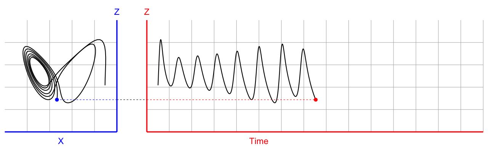

# Introduction to EDMs 

EDMs are a data-driven solution for uncovering hidden dynamic behavior in natural systems, which are often complex and dynamic (referred to as “non-stationarity” or “non-linearity”). This non-linearity means that the sign and magnitude of relationships within a system change with time, and therefore linear statistical approaches fail to properly represent such changes. Rather than assuming that the system is governed by any set of equations (i.e. unlike meteorological systems), EDMs reconstruct the dynamics of the system from time series data (hence “data-driven”) and provide a mechanistic understanding of the system. Under EDMs, the dynamics of a system are encoded in the temporal ordering of the time series, and the behavior of such a system can be explained by relating various states of a system using time lags (i.e. estimating the mathematical relationship of one variable at time X(t), to the same variable at other times: X(t+1) and X(t+2). By relating states of a system using such lags, causal relationships between variables in the original system may be uncovered--providing a number of ecologically relevant applications, including forecasting. 



To reiterate, EDMs are driven by non-linear dynamics in a system (the relationship of a variable, or state, at various time lags vary in sign and magnitude). Taken’s theorem--the basis of EDM--states that an original system’s dynamics can be reconstructed by exploiting the mathematical relationships between historical records of a single variable. These relationships can be mapped 1-to-1 using the Lorens Attractor (also known as the Butterfly attractor). 


# Tutorial on forecasting with stationary and non-stationary time series 

### Load libraries
```{r message=FALSE, warning=FALSE}
library(astsa)
library(rEDM)
library(tidyverse)
library(forecast)
library(ggpubr)
```

### Set time series parameters, where time = hrs and the temporal range is 4 days
```{r}
set.seed(1)

time = 1:96
```

# Stationary time series
### Simulate autocorrelated timeseries data with stationarity (linear data, with cyclical autocorrelation) using `arima.sim`
#### Arima, or AutoRegressive Integrated Moving Average, models necessarily assume linearity, because they rely on a linear relationship to predict values from one time step to another. 
```{r}
stationary_y_arima <- arima.sim(n = length(time), list(ar = c(0.9, -0.8), ma = c(-0.41, 0.2)),
                                sd = sqrt(0.1))

df_ts <- data.frame(x = time, y = stationary_y_arima)

autoplot(stationary_y_arima) + ylab("Stationary Time Series")
```

### Visualize autocorrelation structures using the Parial Autocorrelation Function Estimation feature in the `forecast` package (function `acf()`)
```{r}
acf(stationary_y_arima)
pacf(stationary_y_arima)
```

### Partition data into training and predicting subsets:
```{r}
train <- 1:(length(time)/2)             # indices for the first 2/3 of the time series
```

# Arima models for forecasting:

### Run a standard Arima model, with no lag dependencies
#### This model is mathematically identical to a intercept only linear model with 
$\epsilon_t$ as an error term. 

$$\Large \hat{y}_{t} = \mu + \epsilon_t$$

#### Where, the intercept is equal to the mean of the response variable: 
$$\Large \mu = \frac{1}{n} \sum_{i=1}^{n} y_{i}$$

```{r}
a <- Arima(stationary_y_arima[train])

#plot the fitted values from Arima model
autoplot(fitted(a), col = "blue") + geom_path(data = df_ts, aes(x = x, y = y)) + ylab("Stationary Time Series")
```

### Perform forecast of prediction data using a no-lag Arima model
```{r}
autoplot(forecast(a, h = 48)) + geom_path(data = df_ts, aes(x = x, y = y)) + ylab("Stationary Time Series")
```

### Autoregressive model, with one time dependency--an hourly lag term:
$$\Large \hat{y}_{t} = \mu + \phi_{1}y_{t-1} + \epsilon_t$$

Where, $\Large \phi_1$ is a coefficient of lag 
```{r}
a1 <- Arima(stationary_y_arima[train], c(1,0,0))

#plot the fitted values from Arima model
autoplot(fitted(a1), col = "blue") + geom_path(data = df_ts, aes(x = x, y = y)) + ylab("Stationary Time Series")

#plot the forecasted values from Arima model
autoplot(forecast(a1, h = 48)) + geom_path(data = df_ts, aes(x = x, y = y)) + ylab("Stationary Time Series")
```

### Autoregressive model, with two hourly lags:
$$\Large \hat{y}_{t} = \mu + \phi_{1}y_{t-1} + \phi_{2}y_{t-1} + \epsilon_t$$

```{r}
a2 <- Arima(stationary_y_arima[train], c(1,0,0))

#plot the fitted values from Arima model
autoplot(fitted(a2), col = "blue") + geom_path(data = df_ts, aes(x = x, y = y)) + ylab("Stationary Time Series")

#plot the forecasted values from Arima model
autoplot(forecast(a2, h = 48)) + geom_path(data = df_ts, aes(x = x, y = y)) + ylab("Stationary Time Series")
```

#### Autoregressive models, with up to 5 hourly lags:
$$\Large \hat{y}_{t} = \mu + \phi_1y_{t-1} + [...] + \phi_{j}y_{2-j} + \epsilon_t$$

```{r}
a3 <- Arima(stationary_y_arima[train], c(3,0,0))
a4 <- Arima(stationary_y_arima[train], c(4,0,0))
a5 <- Arima(stationary_y_arima[train], c(5,0,0))

a1_gg <- autoplot(forecast(a3, h = 48)) + ggtitle("Arima Model Forecast: 3 hourly lags") +
  geom_path(data = df_ts, aes(x = x, y = y)) + 
  geom_path(aes(x = time[train], y = fitted(a3)[train]), col = "blue") + 
   ylab(" ")

a2_gg <- autoplot(forecast(a4, h = 48)) + ggtitle("Arima Model Forecast: 4 hourly lags") +
  geom_path(data = df_ts, aes(x = x, y = y)) + 
  geom_path(aes(x = time[train], y = fitted(a4)[train]), col = "blue") + 
   ylab("Stationary Time Series")

a3_gg <- autoplot(forecast(a5, h = 48)) + ggtitle("Arima Model Forecast: 5 hourly lags") +
  geom_path(data = df_ts, aes(x = x, y = y)) + 
  geom_path(aes(x = time[train], y = fitted(a5)[train]), col = "blue") + 
   ylab(" ")

ggarrange(a1_gg, a2_gg, a3_gg, ncol = 1)
```

### Now, we can move into models with different cycle structures. For this, we will consider half day lags (12 hr periods)

#### Autoregressive models, with an hourly- and half-day-time dependency:
$$\Large \hat{y}_{t} = \mu + \phi_1y_{t-1} + \phi_2y_{t-12} + \epsilon_t$$

```{r}
a41 <- Arima(stationary_y_arima[train], c(4,0,0), c(1,0,0))

autoplot(forecast(a41, h = 48)) + ggtitle("Arima Model Forecast: 4 hourly cycle lag") +
  geom_path(data = df_ts, aes(x = x, y = y)) + 
  geom_path(aes(x = time[train], y = fitted(a41)[train]), col = "blue") +
  ylab("Stationary Time Series")
```

### Now, we will let the Arima algorithm choose the time lag parameters, using `auto.arima`:
```{r}
aa <- auto.arima(stationary_y_arima[train])
summary(aa)
# Auto-arima chose a 3-hour lag structure, with no half-day effects

autoplot(forecast(aa, h = 48)) + geom_path(data = df_ts, aes(x = x, y = y)) + 
  ylab("Stationary Time Series")
```

# Non-stationary time series 

### Now we will simulate non-linear (a.k.a. non-stationary) data, where relationships change through time, using `diffinv`:
```{r}
## non-stationary data
set.seed(44)
nonstationary_y <- diffinv(rnorm(length(time))) %>% ts()

autoplot(nonstationary_y) + ylab("Non-stationary Time Series")
```

### Let's see what the auto Arima algorithm estimates with non-stationary data:
```{r}
aa_ns <- auto.arima(nonstationary_y[train])

summary(aa_ns)
```

### Now, visualize forecast of a linear model with non-linear data! 
```{r}
df_ts_st <- data.frame(x = time, y = nonstationary_y[1:96])

aa_ns <- autoplot(forecast(aa_ns, h = 48)) + 
  geom_path(data = df_ts_st, aes(x = x, y = y)) + 
  ylab("Non-stationary Time Series"); aa_ns
```

### Not a very good prediction... Let's try empirical dynamic models!


# Empirical Dynamic Models for forecasting:
### We will use the `simplex` function to determine how many dimensions (time lags) are needed to effectively develope a data-driven mechanistic formulation of the time series
```{r}
# set data for historical record (library) and prediction
lib <- c(1, 48)
pred <- c(49, 96)

simplex_output <- simplex(nonstationary_y, lib, pred)
str(simplex_output)
```

### Let's visualize the forecasting skill (rho)
```{r}
par(mar = c(4, 4, 1, 1), mgp = c(2.5, 1, 0))  # set margins for plotting
plot(simplex_output$E, simplex_output$rho, type = "l", lwd = 5, col = "light blue", xlab = "Embedding Dimension (E)", 
     ylab = "Forecast Skill (rho)")

simplex_output <- simplex(nonstationary_y, lib, pred, E = 2, tp = 1:10)
plot(simplex_output$tp, simplex_output$rho, type = "l", lwd = 5, col = "light blue", xlab = "Time to Prediction (tp)", 
     ylab = "Forecast Skill (rho)")
```

### Run `simplex` to create EDM model for forecasting
```{r}
smap_output <- simplex(nonstationary_y, lib, pred, E = 2, stats_only = FALSE)

predictions <- na.omit(smap_output$model_output[[1]])

df_ts_st_pred <- data.frame(x = time[51:96], y = nonstationary_y[51:96], predictions)

plot(df_ts_st$y~df_ts_st$x, type = "l")

edm <- ggplot(data = df_ts_st_pred) + ggtitle("Forecasts from EDM") + xlab("Time") + ylab(" ") + 
  geom_ribbon(aes(x = x, y = y, ymin = y - 1.96*sqrt(pred_var), ymax = y +.96*sqrt(pred_var)), fill = "blue", alpha = 0.2) +
  geom_ribbon(aes(x = x, y = y, ymin = y-sqrt(pred_var), ymax = y+sqrt(pred_var)), fill = "blue", alpha = 0.4) + 
  geom_path(aes(x = x, y = y)) + 
  geom_path(data = df_ts_st, aes(x = x, y = y)) + 
  ylab("Non-stationary Time Series"); edm

ggarrange(aa_ns + coord_cartesian(ylim = c(-20,8)) + ggtitle("Forecast with ARIMA"),
          edm + coord_cartesian(ylim = c(-20,8)) + ggtitle("Forecast with EDM")) + theme_bw()
ggsave("forecasts.jpeg", dpi = 300)
```

